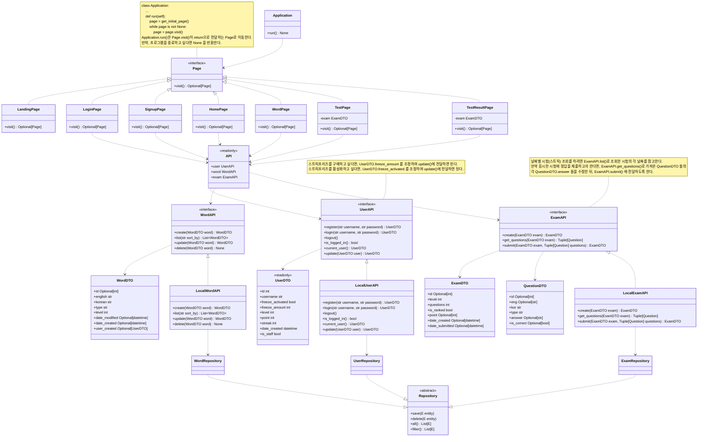

# OTOEIC Front-End (Command Line Interface ver.)

## Class Diagram

```mermaid
classDiagram
direction TB


class Application
Application : +run() None
Application ..> Page


class Page
<<interface>> Page
Page : +visit() Optional[Page]
Page <|.. LandingPage
Page <|.. LoginPage
Page <|.. SignupPage
Page <|.. HomePage
Page <|.. WordPage
Page <|.. TestPage
Page <|.. TestResultPage

note for Page "class Application:
&nbsp;&nbsp;&nbsp;&nbsp;...
&nbsp;&nbsp;&nbsp;&nbsp;def run(self):
&nbsp;&nbsp;&nbsp;&nbsp;&nbsp;&nbsp;&nbsp;&nbsp;page = get_initial_page()
&nbsp;&nbsp;&nbsp;&nbsp;&nbsp;&nbsp;&nbsp;&nbsp;while page is not None:
&nbsp;&nbsp;&nbsp;&nbsp;&nbsp;&nbsp;&nbsp;&nbsp;&nbsp;&nbsp;&nbsp;&nbsp;page = page.visit()

Application.run()은 Page.visit()이 return으로 전달하는 Page로 이동한다.
만약, 프로그램을 종료하고 싶다면 None 을 반환한다."


LandingPage : +visit() Optional[Page]

LoginPage ..> API
LoginPage : +visit() Optional[Page]

SignupPage ..> API
SignupPage : +visit() Optional[Page]

HomePage ..> API
HomePage : +visit() Optional[Page]

WordPage ..> API
WordPage : +visit() Optional[Page]

TestPage ..> API
TestPage : +visit() Optional[Page]
TestPage : -exam ExamDTO

TestResultPage ..> API
TestResultPage : +visit() Optional[Page]
TestResultPage : -exam ExamDTO


class UserDTO
<<readonly>> UserDTO
UserDTO : +id int
UserDTO : +username str
UserDTO : +freeze_activated bool
UserDTO : +freeze_amount int
UserDTO : +level int
UserDTO : +point int
UserDTO : +streak int
UserDTO : +date_created datetime
UserDTO : +is_staff bool


class WordDTO
WordDTO : +id Optional[int]
WordDTO : +english str
WordDTO : +korean str
WordDTO : +type str
WordDTO : +level int
WordDTO : +date_modified Optional[datetime]
WordDTO : +date_created Optional[datetime]
WordDTO : +user_created Optional[UserDTO]


class ExamDTO
ExamDTO : +id Optional[int]
ExamDTO : +level int
ExamDTO : +questions int
ExamDTO : +is_ranked bool
ExamDTO : +point Optional[int]
ExamDTO : +date_created Optional[datetime]
ExamDTO : +date_submitted Optional[datetime]


class QuestionDTO
QuestionDTO : +id Optional[int]
QuestionDTO : +eng Optional[str]
QuestionDTO : +kor str
QuestionDTO : +type str
QuestionDTO : +answer Optional[str]
QuestionDTO : +is_correct Optional[bool]


class API
<<readonly>> API
API : +user UserAPI
API : +word WordAPI
API : +exam ExamAPI
API ..> UserAPI
API ..> WordAPI
API ..> ExamAPI


class UserAPI
<<interface>> UserAPI
UserAPI : +register(str username, str password) UserDTO
UserAPI : +login(str username, str password) UserDTO
UserAPI : +logout()
UserAPI : +is_logged_in() bool
UserAPI : +current_user() UserDTO
UserAPI : +update(UserDTO user) UserDTO
UserAPI ..> UserDTO
UserAPI <|.. LocalUserAPI

note for UserAPI "스트릭프리즈를 구매하고 싶다면, UserDTO.freeze_amount 를 조정하여 update()에 전달하면 된다.
스트릭프리즈를 활성화하고 싶다면, UserDTO.freeze_activated 를 조정하여 update()에 전달하면 된다."


class WordAPI
<<interface>> WordAPI
WordAPI : +create(WordDTO word) WordDTO
WordAPI : +list(str sort_by) List~WordDTO~
WordAPI : +update(WordDTO word) WordDTO
WordAPI : +delete(WordDTO word) None
WordAPI ..> WordDTO
WordAPI <|.. LocalWordAPI


class ExamAPI
<<interface>> ExamAPI
ExamAPI : +create(ExamDTO exam) ExamDTO
ExamAPI : +get_questions(ExamDTO exam) Tuple[Question]
ExamAPI : +submit(ExamDTO exam, Tuple[Question] questions) ExamDTO
ExamAPI ..> ExamDTO
ExamAPI ..> QuestionDTO
ExamAPI <|.. LocalExamAPI

note for ExamAPI "날짜별 시험(스트릭) 조회를 하려면 ExamAPI.list()로 조회한 시험의 각 날짜를 참고한다.

만약 응시한 시험에 정답을 제출하고자 한다면, ExamAPI.get_questions()로 가져온 QuestionDTO 들의
각 QuestionDTO.answer 들을 수정한 뒤, ExamAPI.submit() 에 전달하도록 한다."


class LocalUserAPI
LocalUserAPI : +register(str username, str password) UserDTO
LocalUserAPI : +login(str username, str password) UserDTO
LocalUserAPI : +logout()
LocalUserAPI : +is_logged_in() bool
LocalUserAPI : +current_user() UserDTO
LocalUserAPI : +update(UserDTO user) UserDTO
LocalUserAPI ..> UserRepository


class LocalWordAPI
LocalWordAPI : +create(WordDTO word) WordDTO
LocalWordAPI : +list(str sort_by) List~WordDTO~
LocalWordAPI : +update(WordDTO word) WordDTO
LocalWordAPI : +delete(WordDTO word) None
LocalWordAPI ..> WordRepository


class LocalExamAPI
LocalExamAPI : +create(ExamDTO exam) ExamDTO
LocalExamAPI : +get_questions(ExamDTO exam) Tuple[Question]
LocalExamAPI : +submit(ExamDTO exam, Tuple[Question] questions) ExamDTO
LocalExamAPI ..> ExamRepository


UserRepository ..|> Repository
WordRepository ..|> Repository
ExamRepository ..|> Repository


class Repository~E~
<<abstract>> Repository
Repository : +save(E entity)
Repository : +delete(E entity)
Repository : +all() List[E]
Repository : +filter() List[E]
```